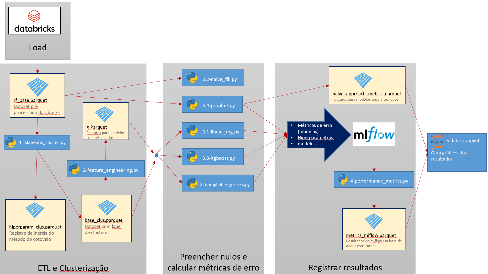

# phylna

 
## Codes used at the final project of USP MBA - Data Science & Analytics 

### Goal: 
#### Solve the problem of multiple consecutive nulls that standard approach (ffill, bfill, near, interpolation, etc) don't work well.
__
### What the scripts in this repository do?
- Input values considering other time series as features in a  semi supervisioned approach and uses the best approach at each null.
__
### How many time series can be features?
- As many as you want. The time series are clustered and selected with feature engineering before the semi supervisioned approach.
__
### What are the semi supervisioned and clustering algorithms chose?
- tsklearn (cluster time series), facebook prophet, xgboost and linear regression
__
### Did it worked in some dataset ?
- Yes, fuel pricing data of brazilian gas stations. It is at the ./data folder (rf_base.parquet and outliers_base.parquet). The data is public. 
__
### Were the results good?
- For more than 20 consecutive nulls the approach performed better than the standard methods (ffill, bfill, etc).
__
### How can you reproduce results? 
- Execute the scripts in the order of its own prefix. The schema below ilustrates the inputs and outputs paths and order of execution in a DAG.

__
### TO-DOs
 Enhance the approach and create a python library, first only with trivial methods selector.
